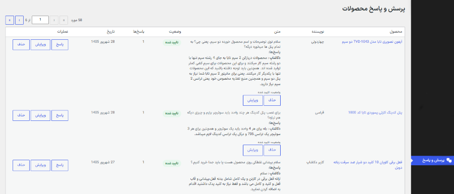
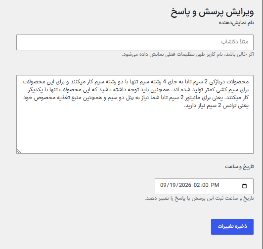
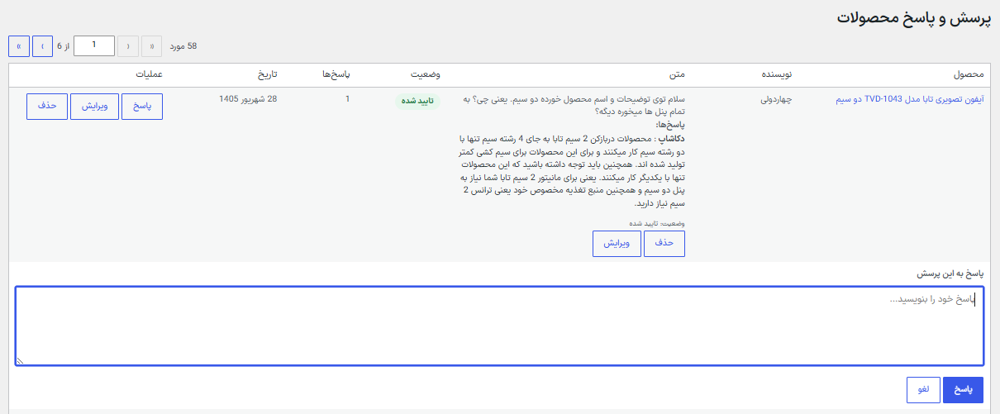

# DCQA — WordPress Product Q&A Plugin

A custom Product Questions & Answers plugin developed for WordPress and WooCommerce.

DCQA provides a dedicated Q&A system for WooCommerce products, allowing customers to ask questions and users to submit answers through a structured, manageable interface.

## ✨ Features

* Product-specific Questions & Answers
* User questions and answers
* Admin moderation
* Question and answer management from WordPress admin
* Parent/child question structure
* User-based display names
* Custom database table for Q&A data
* WooCommerce product integration
* Custom frontend template
* Custom WordPress admin interface
* Login handling for guests
* SEO-friendly structured data integration

## 🛠️ Technologies

* PHP
* WordPress
* WooCommerce
* MySQL
* JavaScript
* jQuery
* HTML
* CSS

## 📁 Project Structure

```text
dcashop-product-qa/
├── assets/
│   ├── css/
│   │   ├── admin.css
│   │   └── style.css
│   └── js/
│       ├── admin.js
│       └── main.js
│
├── includes/
│   ├── class-admin.php
│   ├── class-ajax.php
│   ├── class-answer-admin.php
│   ├── class-answer.php
│   ├── class-assets.php
│   ├── class-db.php
│   ├── class-edit.php
│   ├── class-frontend.php
│   ├── class-schema.php
│   ├── functions.php
│   └── helpers.php
│
├── templates/
│   ├── popup-answer.php
│   ├── popup-question.php
│   ├── question-item.php
│   └── questions.php
│
└── dcashop-product-qa.php
```

## 📸 Screenshots

### Product Page - No Questions


### Admin - Question & Answer Management




### Admin - Edit Answer




### Admin - Add Answer




### Product Page - Questions & Answers


## 🎯 Purpose

The plugin was developed as a custom solution for adding a dedicated product Q&A system to WooCommerce websites without relying on a third-party Q&A plugin.

It is designed to provide a flexible foundation for product-related questions, answers, moderation, and future feature development.

## 👨‍💻 Developer

**Seyyed Behzad Mousaviyan**

WordPress & WooCommerce Developer
